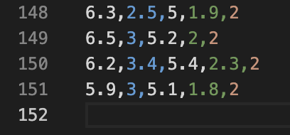
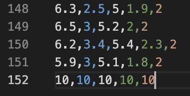
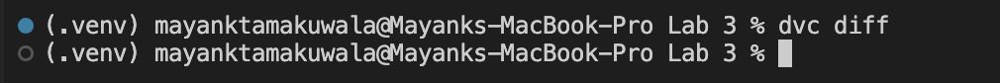
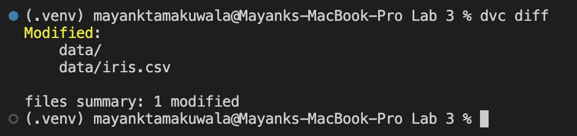

## Lab 3 – Simple Iris Regression

This lab caches the Iris dataset locally and trains a linear regression model to predict `sepal_length`. The goal is to keep the dataset under version control with DVC while experimenting with data changes.

### Prerequisites
- Python 3.9+
- `pip install pandas scikit-learn`
- (Optional) `pip install dvc`

### Run the script
- Run the `main.ipynb` Jupyter Notebook or `python3 main.py`.
This downloads the Iris dataset from scikit-learn, writes it to `data/iris.csv`, trains a regression model, and prints evaluation metrics.

### Track the dataset with DVC
```bash
dvc init
dvc add data
git add data.dvc .gitignore
git commit -m "Track iris data with DVC"
```

### Check if there are any changes:
```bash
dvc diff
```

### Data snapshots
- **Before update** – fresh export from scikit-learn:  
  
- **After update** – manual tweak to illustrate a change tracked by DVC:  
  

### DVC diff snapshots
- **Before edit** – no tracked changes:  
  
- **After edit** – `data/iris.csv` flagged as modified:  
  

Use DVC to track these changes and reproduce experiments as the data evolves.
