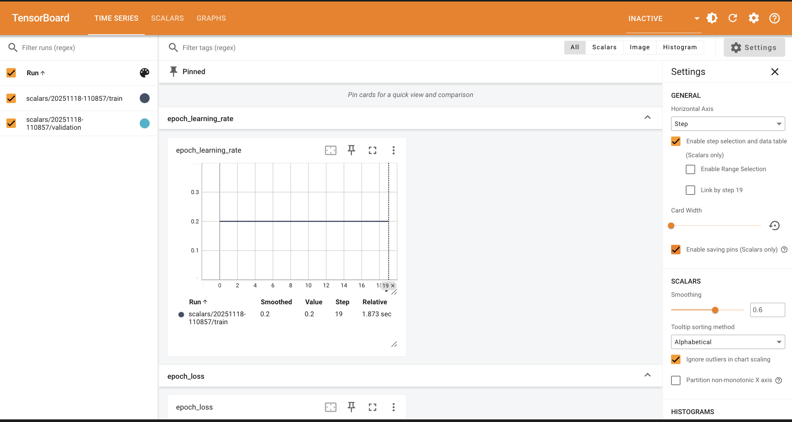
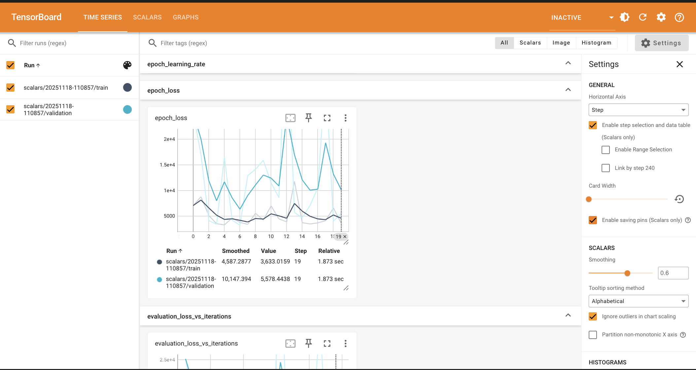
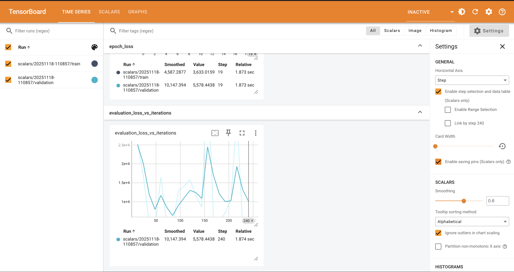

# Lab 5 - TensorBoard Linear Regression

## Overview
This lab recreates the TensorFlow 2.x TensorBoard workflow using a simple linear regression model trained on the scikit-learn diabetes dataset. The run mirrors the original notebook’s structure-clearing logs, loading the TensorBoard notebook extension, and emitting detailed debug traces through `tf.debugging.experimental.enable_dump_debug_info`. All training, evaluation, and debugger data are written to `logs/` so they can be inspected live in TensorBoard.

Key ingredients:
- Dataset: `sklearn.datasets.load_diabetes`, split 80/20 with `train_test_split`.
- Preprocessing: Standardize each feature via `StandardScaler`.
- Model: Single `Dense(1)` layer with an explicit `Input(shape=(X_train.shape[1],))`, trained with SGD (learning rate `0.2`) and MSE loss for 20 epochs.
- Instrumentation: TensorBoard callback plus the TensorFlow debugger dump for FULL_HEALTH tensor tracing.

## Prerequisites
```bash
python -m venv .venv
source .venv/bin/activate
pip install tensorflow scikit-learn notebook
```

## Running the Lab
1. Launch Jupyter Lab/Notebook from this directory: `jupyter lab` (or open `Lab1.ipynb` in VS Code).
2. Execute the notebook cells sequentially:
   - Load TensorBoard extension.
   - Clear `./logs/` if you want a fresh run.
   - Import libraries and verify TensorFlow ≥ 2.0.
   - Load and scale the diabetes dataset.
   - Define the TensorBoard callback and linear regression model, then train for 20 epochs.
3. Start TensorBoard inside the notebook (`%tensorboard --logdir logs/`) or via CLI (`tensorboard --logdir logs/`).

Each run writes to a timestamped directory under `logs/scalars/`, so multiple experiments can be compared side-by-side by checking multiple boxes in the left-hand run selector.

## TensorBoard Observations
The provided screenshots capture the `scalars/20251118-110857` run:
- **epoch_learning_rate** remains a flat line at 0.2, confirming that stochastic gradient descent uses a constant LR throughout training.
- **epoch_loss** shows training MSE hovering around 3.6k with validation loss roughly 5.6k. The validation curve exhibits more variance because the dataset is small and only a single linear layer is trained.
- **evaluation_loss_vs_iterations** plots the per-step validation loss logged during each evaluation phase. The oscillations reflect how well the simple linear regressor fits different mini-batches of the standardized features.

<p align="center">
  
  <br/>
  
  <br/>
  
</p>

Use the Settings panel’s smoothing slider (set to `0.6` in the screenshots) to filter noise, and the step selection table to inspect precise values at a given epoch. The debugger dashboard can also be opened to inspect any NaN/∞ alerts or tensor health anomalies recorded by the dump path.

## Reproducing the Screenshots
1. Run the notebook.
2. Open TensorBoard and navigate to the **Time Series** dashboard.
3. Enable the `scalars/<timestamp>/train` and `scalars/<timestamp>/validation` runs.
4. Pin the `epoch_learning_rate`, `epoch_loss`, and `evaluation_loss_vs_iterations` cards for quick comparison.
5. Adjust smoothing and axis settings as needed, then capture the view (see attached images in the project submission).

## Next Steps
- Experiment with different optimizers (Adam, RMSprop) or learning rates to shrink validation loss.
- Add new scalar summaries or histogram logging to visualize weight distributions.
- Capture additional debugger screenshots (Alerts, Execution Timeline, Graph Execution) if your assignment requires deeper analysis.

This README documents everything needed to rerun the notebook, inspect TensorBoard, and explain the observed metrics for the lab submission.
